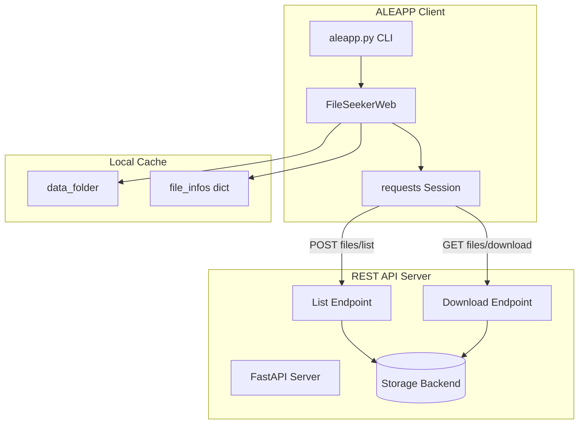
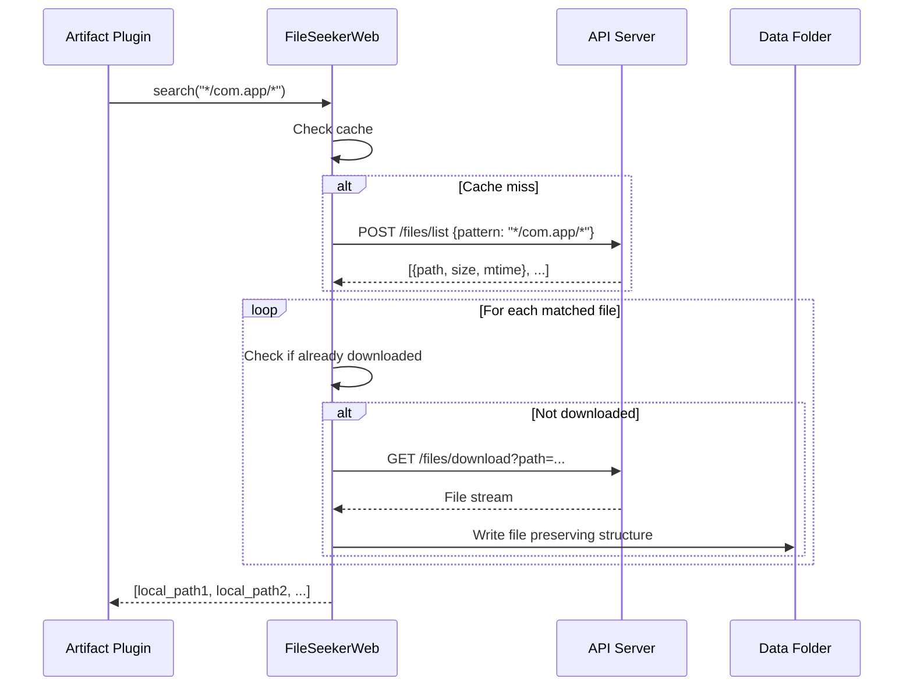

# Design Document: FileSeekerWeb

## Overview

This design describes a minimal REST API-based file seeker for ALEAPP that enables forensic artifact processing from remote sources. The implementation prioritizes simplicity with just two API endpoints, making it easy for developers to adapt to their own storage backends.

The solution consists of three components:
1. **FileSeekerWeb** - Client class implementing `FileSeekerBase` interface
2. **REST API Contract** - Two-endpoint specification documented in `WEB_API_README.md`
3. **Reference Server** - FastAPI implementation serving a local directory

### Design Principles

- **Minimal API Surface**: Only two endpoints (list files, download file)
- **Consistent Interface**: Same `search()` method signature as existing seekers
- **Easy Adaptation**: Reference server is simple enough to graft onto any storage backend
- **Streaming Downloads**: Large files are streamed to avoid memory issues

## Architecture



### Request Flow



## Components and Interfaces

### FileSeekerWeb Class

```python
class FileSeekerWeb(FileSeekerBase):
    """File seeker that retrieves files from a REST API endpoint."""
    
    def __init__(self, base_url: str, data_folder: str):
        """
        Initialize the web file seeker.
        
        Args:
            base_url: Base URL of the API server (e.g., "http://localhost:8000")
            data_folder: Local directory for caching downloaded files
        """
        pass
    
    def search(self, filepattern: str, return_on_first_hit: bool = False, 
               force: bool = False) -> Union[List[str], str]:
        """
        Search for files matching the glob pattern.
        
        Args:
            filepattern: Glob pattern to match (e.g., "*/data/com.app/*")
            return_on_first_hit: If True, return first match as string
            force: If True, bypass cache and re-fetch/re-download
            
        Returns:
            List of local file paths, or single path if return_on_first_hit
        """
        pass
    
    def cleanup(self):
        """Close HTTP session and release resources."""
        pass
```

### REST API Endpoints

#### POST /files/list

Lists files matching a glob pattern.

**Request:**
```json
{
    "pattern": "*/data/com.whatsapp/*"
}
```

**Response:**
```json
{
    "files": [
        {
            "path": "data/com.whatsapp/databases/msgstore.db",
            "size": 1048576,
            "mtime": 1699900000.0
        },
        {
            "path": "data/com.whatsapp/shared_prefs/config.xml",
            "size": 2048,
            "mtime": 1699899000.0
        }
    ]
}
```

#### GET /files/download

Downloads a single file by path. The server may either return the file content directly or redirect to an external storage URL (e.g., S3 pre-signed URL, Azure Blob SAS URL).

**Request:** Query parameter `path` with URL-encoded file path

**Response Options:**
1. **Direct**: File content as `application/octet-stream` with streaming
2. **Redirect**: HTTP 302/307 redirect to external storage URL (S3, Azure Blob, GCS, etc.)

The `FileSeekerWeb` client follows redirects automatically via the `requests` library.

### Reference FastAPI Server

```python
# scripts/web_api_server.py
from fastapi import FastAPI, Query
from fastapi.responses import StreamingResponse
from pathlib import Path
import fnmatch
import os

app = FastAPI(title="ALEAPP Web API Reference Server")

# Configure this to point to your extraction directory
EXTRACTION_ROOT = "/path/to/extraction"

@app.post("/files/list")
async def list_files(request: dict):
    """List files matching a glob pattern."""
    pass

@app.get("/files/download")
async def download_file(path: str = Query(...)):
    """Download a file by path."""
    pass
```

## Data Models

### FileListRequest

```python
@dataclass
class FileListRequest:
    """Request body for the /files/list endpoint."""
    pattern: str  # Glob pattern to match files
```

### FileMetadata

```python
@dataclass
class FileMetadata:
    """Metadata for a single file in the listing response."""
    path: str           # Relative path from extraction root
    size: int           # File size in bytes
    mtime: float        # Modification time as Unix timestamp (optional)
```

### FileListResponse

```python
@dataclass
class FileListResponse:
    """Response body for the /files/list endpoint."""
    files: List[FileMetadata]  # List of matching files with metadata
```

### FileInfo (Existing)

The existing `FileInfo` class from `search_files.py` is reused:

```python
class FileInfo:
    """Metadata stored for each downloaded file."""
    def __init__(self, source_path, creation_date, modification_date):
        self.source_path = source_path      # Original path on server
        self.creation_date = creation_date  # Creation timestamp (may be None)
        self.modification_date = modification_date  # Modification timestamp
```

### Internal State

```python
# FileSeekerWeb internal state
self.base_url: str              # API server base URL
self.data_folder: str           # Local cache directory
self.session: requests.Session  # HTTP session for connection reuse
self.searched: Dict[str, List[str]]  # Cache: pattern -> local paths
self.copied: Dict[str, str]     # Cache: remote path -> local path
self.file_infos: Dict[str, FileInfo]  # Cache: local path -> metadata
```


## Correctness Properties

*A property is a characteristic or behavior that should hold true across all valid executions of a system—essentially, a formal statement about what the system should do. Properties serve as the bridge between human-readable specifications and machine-verifiable correctness guarantees.*

### Property 1: Pattern Matching Returns Correct Files

*For any* glob pattern and any set of files on the server, calling `search(pattern)` SHALL return only files whose paths match the pattern, and SHALL return all files that match.

**Validates: Requirements 3.1**

### Property 2: Download Content Integrity (Round-Trip)

*For any* file that exists on the server, downloading it via the API and reading the local copy SHALL produce content identical to the original file.

**Validates: Requirements 1.3, 4.1**

### Property 3: Invalid URL Rejection

*For any* string that is not a valid HTTP or HTTPS URL, initializing `FileSeekerWeb` with that string SHALL raise a descriptive error.

**Validates: Requirements 2.2**

### Property 4: State Preservation After Initialization

*For any* valid base URL and data folder path, after initialization the `FileSeekerWeb` instance SHALL have `base_url` and `data_folder` attributes matching the provided values.

**Validates: Requirements 2.4**

### Property 5: Return On First Hit Behavior

*For any* pattern that matches multiple files, calling `search(pattern, return_on_first_hit=True)` SHALL return a single string (not a list) that is a valid path to one of the matching files.

**Validates: Requirements 3.2**

### Property 6: Search Result Caching

*For any* pattern, calling `search(pattern)` twice without `force=True` SHALL return the same results and SHALL NOT make a second API call.

**Validates: Requirements 3.4**

### Property 7: Search Force Bypasses Cache

*For any* pattern that has been previously searched, calling `search(pattern, force=True)` SHALL make a new API call regardless of cached results.

**Validates: Requirements 3.5**

### Property 8: Download Caching

*For any* file that has been previously downloaded, a subsequent search matching that file SHALL NOT re-download it (unless `force=True`).

**Validates: Requirements 4.3**

### Property 9: Download Force Bypasses Cache

*For any* file that has been previously downloaded, calling `search()` with `force=True` SHALL re-download the file.

**Validates: Requirements 4.4**

### Property 10: Directory Structure Preservation

*For any* downloaded file, the local path relative to `data_folder` SHALL match the remote path structure from the server.

**Validates: Requirements 4.2**

### Property 11: FileInfo Population

*For any* downloaded file, the `file_infos` dictionary SHALL contain a `FileInfo` object with `source_path` matching the remote path and `modification_date` matching the server-provided mtime.

**Validates: Requirements 4.6**

### Property 12: Cleanup Idempotence

*For any* `FileSeekerWeb` instance, calling `cleanup()` multiple times SHALL NOT raise an error.

**Validates: Requirements 6.2**

### Property 13: HTTP Error Code Handling

*For any* HTTP error status code (4xx, 5xx) returned by the server, the `FileSeekerWeb` SHALL handle it gracefully without crashing and SHALL log an appropriate error message.

**Validates: Requirements 8.3**

## Error Handling

### Connection Errors

| Error Condition | Handling |
|----------------|----------|
| Server unreachable | Raise `ConnectionError` with URL and timeout details |
| DNS resolution failure | Raise `ConnectionError` with hostname |
| Connection timeout | Raise `ConnectionError` with timeout value |

### HTTP Errors

| Status Code | Handling |
|-------------|----------|
| 400 Bad Request | Log error, return empty list for search |
| 404 Not Found | Log warning, skip file in download |
| 500 Server Error | Log error, continue with other files |
| Other 4xx/5xx | Log error with status code, continue |

### Validation Errors

| Error Condition | Handling |
|----------------|----------|
| Invalid base URL | Raise `ValueError` with description |
| Invalid JSON response | Log error, raise `ValueError` |
| Missing required fields | Log warning, use defaults where possible |

### Download Errors

| Error Condition | Handling |
|----------------|----------|
| File not found (404) | Log warning, skip file, continue |
| Permission denied (403) | Log error, skip file, continue |
| Incomplete download | Log error, remove partial file, continue |
| Disk full | Raise `IOError`, stop processing |

## Testing Strategy

### Dual Testing Approach

Testing combines unit tests for specific examples/edge cases and property-based tests for universal correctness:

- **Unit tests**: Verify specific examples, edge cases, error conditions
- **Property tests**: Verify universal properties across randomly generated inputs

### Property-Based Testing Configuration

- **Library**: `hypothesis` (Python's standard PBT library)
- **Minimum iterations**: 100 per property test
- **Tag format**: `# Feature: file-seeker-web, Property N: <property_text>`

### Test Categories

#### Unit Tests

1. **Initialization tests**
   - Valid HTTP URL accepted
   - Valid HTTPS URL accepted
   - Invalid URL rejected with clear error
   - Unreachable server raises connection error

2. **Search tests**
   - Empty pattern returns all files
   - Specific pattern returns matching files
   - Non-matching pattern returns empty list
   - `return_on_first_hit` returns string not list

3. **Download tests**
   - File downloaded to correct location
   - Directory structure preserved
   - FileInfo populated correctly
   - Download failure logged, processing continues

4. **Cleanup tests**
   - Session closed after cleanup
   - Multiple cleanup calls safe

5. **CLI integration tests**
   - 'web' extract type accepted
   - URL accepted as input path
   - FileSeekerWeb instantiated correctly

#### Property-Based Tests

Each correctness property from the design document will have a corresponding property-based test:

| Property | Test Strategy |
|----------|---------------|
| Property 1: Pattern Matching | Generate random file trees and patterns, verify all matches returned |
| Property 2: Download Integrity | Generate random file content, verify round-trip equality |
| Property 3: Invalid URL | Generate malformed URL strings, verify error raised |
| Property 5: First Hit | Generate multi-match scenarios, verify single string returned |
| Property 6: Search Caching | Mock API, verify single call for repeated searches |
| Property 7: Force Search | Mock API, verify call count with force=True |
| Property 8: Download Caching | Track downloads, verify no re-download |
| Property 9: Force Download | Track downloads, verify re-download with force |
| Property 10: Directory Structure | Generate nested paths, verify local structure matches |
| Property 12: Cleanup Idempotence | Call cleanup N times, verify no errors |

### Test File Organization

```
tests/
├── test_file_seeker_web.py      # Unit tests for FileSeekerWeb
├── test_web_api_server.py       # Unit tests for reference server
├── test_properties.py           # Property-based tests
└── conftest.py                  # Shared fixtures (mock server, temp dirs)
```

### Mock Server for Testing

Tests will use a mock HTTP server (via `responses` or `httpretty`) to simulate API responses without requiring a running server. Integration tests may optionally spin up the reference FastAPI server.
